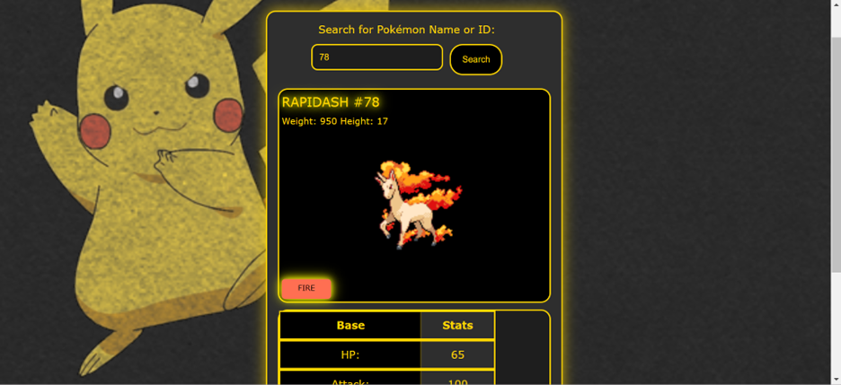

# Pokemon-Search-App 🚀

## 📝

> The Pokémon Search App is a web application that allows users to search for Pokémon by name or ID and view detailed information about each Pokémon. The app fetches data such as the Pokémon's name, ID, weight, height, stats (HP, attack, defense, special attack, special defense, speed), types, and sprite image.

```css
#search-input:focus-visible,
#search-button:focus-visible {
  outline: 3px solid #ffd700;
}
```

```javascript
const resetDisplay = () => {
  const sprite = document.getElementById('sprite');
  if (sprite) sprite.remove();
```

## Demo 📸

[Live Demo](https://elhamy786.github.io/Pokemon-Search-App/)



## Technologies Used 🛠️

- HTML
- CSS
- JavaScript

## Installation 💻

```bash
1: Clone the Repository:
git clone https://github.com/elhamy786/Pokemon-Search-App.git
```

```bash
2: Navigate to the Project Directory:
cd Pokemon-Search-App
```

```bash
3: Open the index.html style.css and script.js Files in Your Browser.
```

## Usage 🎯

```bash
Clone the repository, open it in a code editor, ensure HTML, CSS, and JavaScript setup, launch index.html in a browser or serve it locally, search for Pokémon by entering their name or ID, view detailed information upon submission, and handle errors through alerts for invalid queries.
```

## Features ⭐

- Pokemon Search Functionality: Allows users to search for Pokémon by name or ID using an input form.
- Type Highlighting: Automatically highlights the types of the Pokémon with corresponding colored badges based on its type (e.g., fire, water, electric).
- Dynamic Sprite Display: Shows the sprite (image) of the Pokémon using its front default sprite.

## Author 👩‍💻

- [Linkedin](https://www.linkedin.com/in/elham-afzali-05326130b?utm_source=share&utm_campaign=share_via&utm_content=profile&utm_medium=ios_app)
- [Email](elham.afzali1383@gmail.com)

## Contributing 🤝
Contribute by submitting bug reports, feature requests, or pull requests on the project's GitHub repository, ensuring to follow the contribution guidelines outlined in the README.

